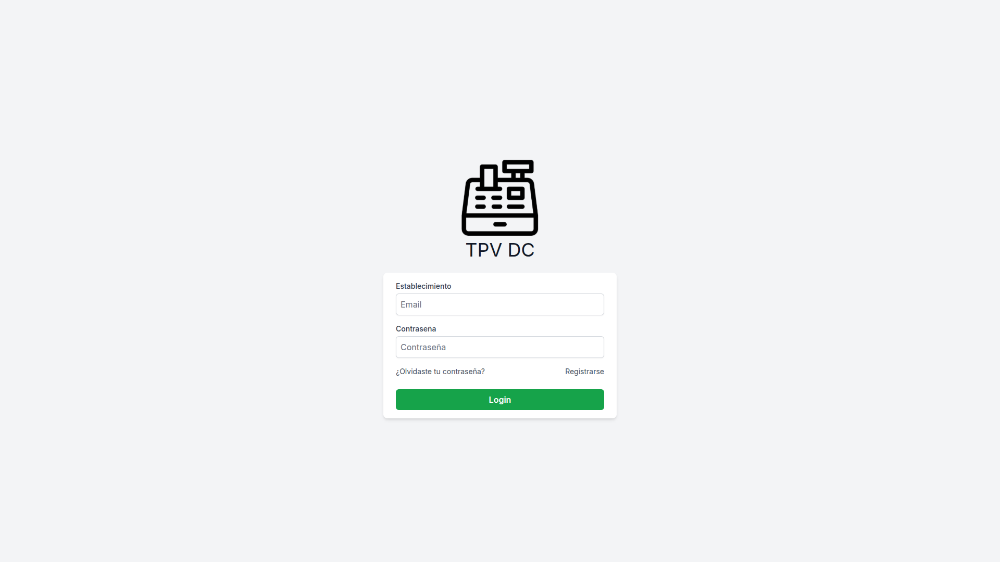
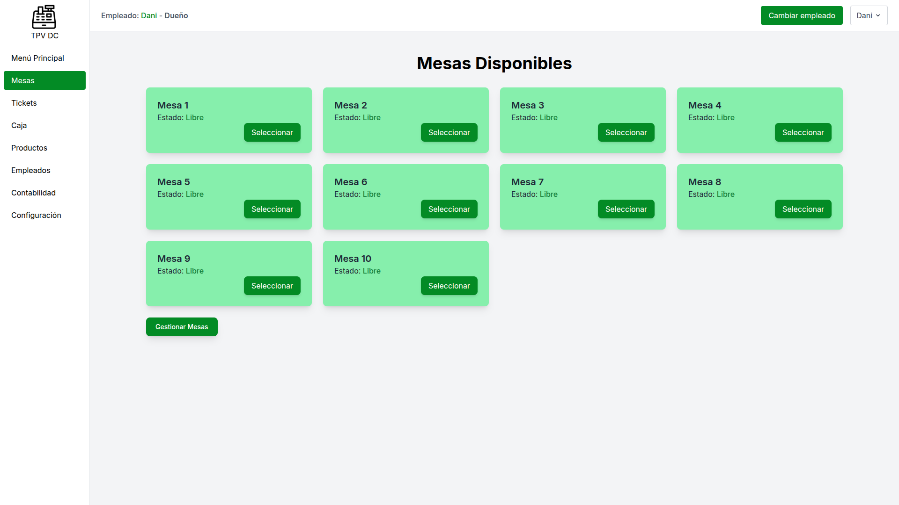
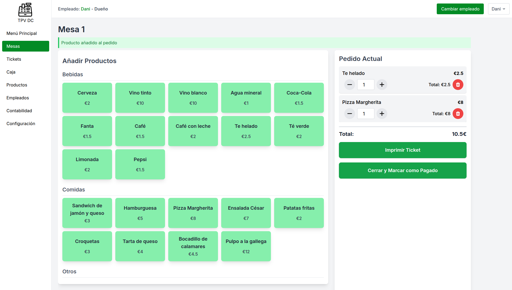

# 🧾 TPV D.C. – Proyecto Final DAW

**Desarrollado por: Daniel Cuevas Naharro**  
**Curso 2024-2025 – CIFP Francesc de Borja Moll**  
**Repositorio:** [github.com/dcuevas-dawi/proyecto-tpv](https://github.com/dcuevas-dawi/proyecto-tpv)  
**Versión MVP en producción:** [www.tpv-dc.com](https://www.tpv-dc.com)
**Documentación ampliada** **[Documentación TPV - Daniel Cuevas.pdf](Documentación TPV - Daniel Cuevas.pdf)**

---

## 🎯 Descripción

Este proyecto consiste en el desarrollo de una aplicación web que actúa como TPV (Terminal Punto de Venta) para establecimientos de hostelería. El objetivo es proporcionar una solución sencilla, funcional y económica para una nueva línea de cajas registradoras de bajo coste de la empresa **TPV D.C. SL**.

---

## 🚀 Funcionalidades principales

- ✅ **Registro y login de establecimientos**
- 🔐 **Identificación de empleados por PIN**
- 👥 **Sistema de roles:** dueño, encargado y empleado
- 🍽️ **Gestión de mesas y productos (CRUD)**
- 🧾 **Pedidos y generación de tickets**
- 💰 **Gestión básica de contabilidad y caja**
- 🔒 **Seguridad de acceso por sesiones y roles**
- 🌐 **Compatible con pantallas 1920x1080**

---

## 🛠️ Tecnologías usadas

| Herramienta         | Uso principal                      |
|---------------------|-------------------------------------|
| Laravel 12          | Backend         |
| Blade + TailwindCSS | Frontend       |
| SQLite              | Base de datos                |
| Nginx               | Servidor web en producción          |
| Azure (VM Ubuntu)   | Hosting          |
| Git / GitHub        | Control de versiones                |

---

## 🖼️ Capturas de pantalla

*Pantalla de acceso de establecimientos*

*Vista general de mesas*

*Gestión de un pedido abierto*

---

## 📄 **Documentación ampliada**

La documentación completa del proyecto está disponible en el archivo:

📘 **[Documentacion.pdf](Documentacion.pdf)**

---
